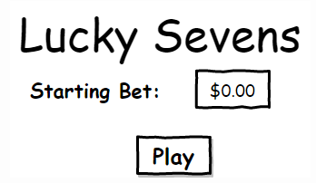
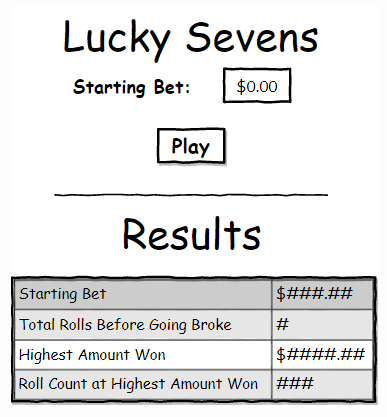

# Simple Game Called Lucky Seven
Live Demo: https://daryldelrosario.github.io/lucky-seven/ 

## Acknowledgements
* The Software Guild: https://www.thesoftwareguild.com

## Requirements

## Brief Description
This assessment was created to demonstrate all that we have learnt in the HTML, CSS and JavaScript modules.

This is a simple game with the following rules:
1. As long as there is money, play the game.
2. Each round, the program rolls a virtual pair of dice for the user:
    * if the sum of the 2 dice is equal to 7, player wins $4
    * otherwise, player loses $1   

There are two states to the page:   
* Initial Layout
 
Initial Layout Diagram 
    
* End of Game Output
   
End of Game Output Diagram

### Flowchart

## Technologies

## Features

## Updates